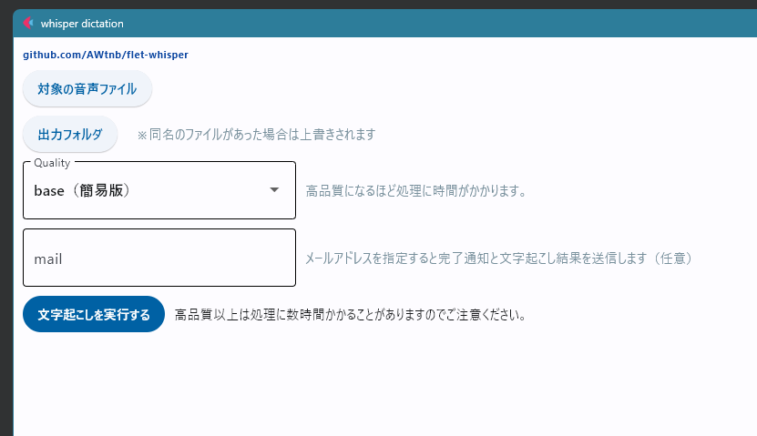
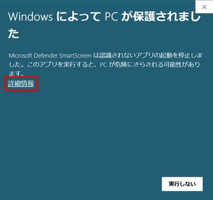

# README

[whisper](https://github.com/openai/whisper) を使って日本語の文字起こしをするGUIアプリケーション（[Flet](https://flet.dev/) 製）。

> [!NOTE]
> このソフトは [ffmpeg](https://ffmpeg.org/) を必要とします。PCにはfmpegがインストールされていて、なおかつffmpegのパスがユーザー環境変数に追加されている必要があります。

## USAGE

`okoshi.exe` 単体で動きます。適当なフォルダに配置してから、ファイルをダブルクリックして起動してください。
黒い画面がしばらく（数十秒～）表示されたあと、メイン画面が立ち上がります。



### 初回起動時のみ必要な操作

おそらく初回の起動時に、Windows からの警告が表示されます。有効化するには下記の操作をしてください。

1. 「PC が保護されました」という表示の場合は「詳細情報」をクリック。

    

1. 表示される「実行」ボタンをクリックするとアプリが起動します。

    

### 2回目以降

1. `対象の音声ファイル` と `出力フォルダ` を指定する
1. `Quality` のドロップダウンリストから文字起こしの品質を指定する
    - medium（高品質）以上を指定すると処理に数時間～数日かかることがあります
1. `文字起こしを実行する` のボタンを押すと処理が開始します
    - 実行中はボタンなどが反応しなくなります
    - 黒い画面に進捗が表示されます
    - メイン画面も黒い画面も閉じずにそのまま待機してください
    - 実行中はPCがとても重くなるので注意してください
1. `mail` にメールアドレスを指定すると、文字起こしが完了した段階でメールで通知します
    - メールには文字起こし結果のテキストファイルが添付されます
    - メール通知後もプログラムを実行したPCには音声ファイルとテキストファイルが残っているので、適宜片付けてください
1. 黒い画面かメイン画面のどちらかを閉じるとプログラムが終了します

## BUILD (for developper)


1. Create `.env` into `assets` folder and set your mail setting.

    ```
    .\
    ├─main.py
    └─assets
        └─.env
    ```


    ```.env
    SENDER_ADDRESS=●●
    CC_ADDRESS=●●
    SENDER_PASSWORD=●●
    SMTP_HOST=●●
    SMTP_PORT=●●
    ```

1. Remove pathlib module for pyinstaller compatibility:

    ```
    python -m pip uninstall pathlib -y
    ```

1. Run:

    ```
    pyinstaller --onefile --name okoshi --collect-data whisper --add-data "assets\.env;assets" .\main.py
    ```

1. Re-install pathlib:

    ```
    python -m pip install pathlib
    ```

---

When running a build using pyinstaller installed with `pip install pyinstaller`, the generated `.exe` file may be considered a virus by Windows Defender.
In this case, using a locally built pyinstaller may solve the problem.

Steps:

1. `git clone https://github.com/pyinstaller/pyinstaller`
1. `cd .\pyinstaller\bootloader\`
1. `python .\waf all`
    + Visual Studio C++ compiler is required for build.
        + It can be installed with [Scoop](https://scoop.sh/) : `scoop install vcredist2015` .
    + In my environment, 2015 and 2022 were installed. If just installing vcredist2015 results in error, try installing the latest version as well.
1. `cd ..` (move to `pyinstaller` directory)
1. `pip install .`

This will build pyinstaller in the python site-package folder.
The folder used for the build is no longer used, so you can delete it.